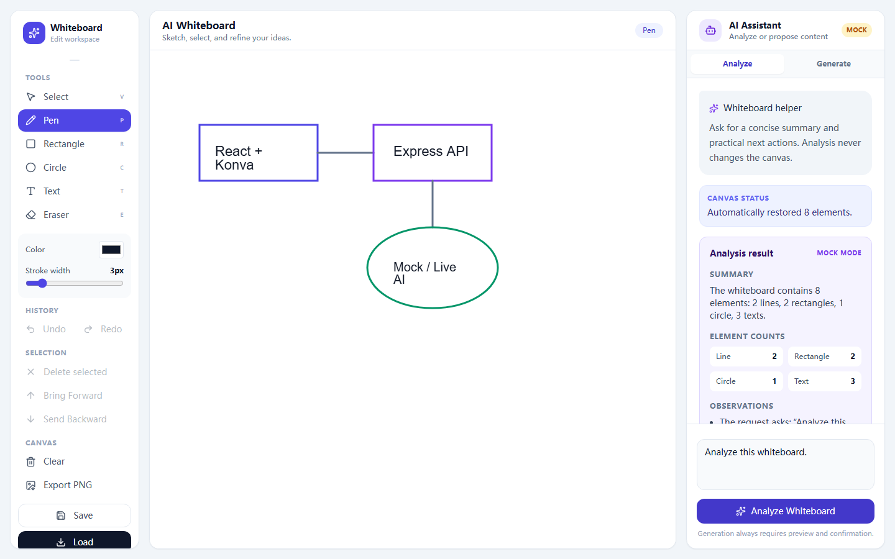
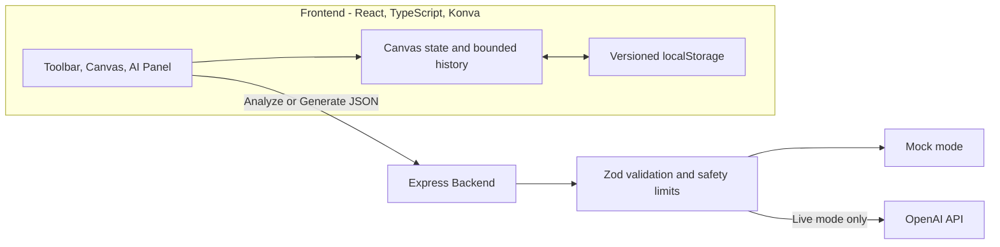

# AI Whiteboard Assistant

> An Excalidraw-inspired React whiteboard with secure, preview-first AI analysis and content generation.

[](https://github.com/guangheihei66-collab/AI-Whiteboard-Assistant/actions/workflows/ci.yml)

**Online demo:** [https://ai-whiteboard-assistant.vercel.app](https://ai-whiteboard-assistant.vercel.app)

**Backend health:** [https://ai-whiteboard-assistant-backend.onrender.com/api/health](https://ai-whiteboard-assistant-backend.onrender.com/api/health)



AI Whiteboard Assistant is a student software engineering project inspired by Excalidraw. It combines a typed Konva whiteboard with a secure Express AI service. AI can analyze the current board or propose new content, but a proposal never changes the canvas until the user previews and explicitly applies it.

## Technology stack

- Frontend: React, TypeScript, Vite, Tailwind CSS, Konva, and react-konva
- Backend: Node.js, Express, TypeScript, Zod, and the official OpenAI Node.js SDK
- Security: strict request validation, restricted CORS, rate limiting, body-size limits, and request timeouts
- Testing: Node test runner, Supertest, Playwright, and Playwright traces
- Persistence: versioned browser `localStorage`

## Completed features

- Pen, Rectangle, Circle, Text, Eraser, and Select tools
- Element movement, resize, rotation, deletion, and layer ordering
- Undo/Redo, keyboard shortcuts, auto-save, Save/Load, and PNG export
- Structured AI analysis with Summary, Element Counts, Observations, Suggestions, and Next Actions
- AI proposals for flowcharts, simple mind maps, architecture sketches, study plans, and sticky-note layouts
- Mandatory Generate → Validate → Preview → Confirm → Apply workflow
- Dashed, translucent canvas previews that are excluded from Save, auto-save, history, and PNG export
- One-step batch Apply, Undo, and Redo for generated proposals
- Mock mode that works without an API key
- Live mode that calls the OpenAI Responses API from the backend only
- Compact canvas summaries: long Line point arrays become bounds, point count, and approximate length
- Loading, duplicate-submit protection, Cancel, Retry, friendly errors, and Mock/Live labels
- React Error Boundary with a safe reload view
- Responsive desktop three-column and small-screen stacked layouts
- Frontend unit tests, backend API tests, Playwright E2E, and GitHub Actions CI

## System architecture



Canvas state, selection, batch history, persistence, and preview application stay in the frontend. All AI requests pass through Express; the browser never calls OpenAI directly. Mock and Live modes share the same validated response contracts.

## Project structure

```text
AI-Whiteboard-Assistant/
├── .github/workflows/ci.yml  # Frontend, backend, and E2E checks
├── frontend/
│   ├── src/components/       # Canvas, Toolbar, Transformer, AI panel, and preview overlay
│   ├── src/hooks/            # Canvas history, shortcuts, and auto-save
│   ├── src/services/ai.ts    # Browser-to-backend AI client
│   ├── src/types/            # Canvas, analysis, and proposal contracts
│   └── src/utils/            # Storage, proposal normalization, and validation
├── backend/
│   ├── src/routes/           # Analyze and Generate routes with rate limiting
│   ├── src/services/         # Analysis, generation, layout, and OpenAI integration
│   ├── src/schemas/          # Zod analysis and generated-canvas schemas
│   ├── src/utils/            # Compact canvas summarization
│   └── src/app.ts            # Express security and middleware setup
├── docs/                     # Architecture, decisions, roadmap, and images
├── render.yaml               # Render backend Blueprint
├── PROJECT_CONTEXT.md        # Durable project state
└── README.md
```

## One-click local startup on Windows

Double-click `start-project.cmd` in the repository root. The launcher validates `project-start.json`, opens the backend and frontend in separate terminal windows, waits for both services, and then opens `http://localhost:5173`.

Mock mode is the default, so an API key is not required. If a service has no `node_modules` directory, the launcher explains that npm will use the committed package files and npm registry, then asks before running the configured project-local install command.

To stop the project, press `Ctrl+C` in each service window or close both service windows. The launcher does not install global packages, change `PATH`, change the machine PowerShell policy, or run as a background Windows service.

Safe configuration-only validation:

```powershell
.\start-project.cmd -ValidateOnly
```

Start without opening the browser:

```powershell
.\start-project.cmd -NoBrowser
```

The three reusable files are `start-project.cmd`, `scripts/start-project.ps1`, and `project-start.json`. See [Reusable project launcher](docs/reusable-project-launcher.md) for adapting them to another project.

## Run in Mock mode manually

Mock mode is the default and does not need an OpenAI API key. It is the recommended starting point for GitHub users.

```bash
cd backend
npm install
```

Copy the environment template:

```powershell
Copy-Item .env.example .env
```

Keep `AI_MOCK_MODE=true`, then start the backend:

```bash
npm run dev
```

In another terminal, start the frontend:

```bash
cd frontend
npm install
npm run dev
```

Open `http://localhost:5173`.

## Run in Live mode

1. Copy `backend/.env.example` to `backend/.env`.
2. Set `AI_MOCK_MODE=false`.
3. Replace the placeholder `OPENAI_API_KEY` value with your own key.
4. Keep `OPENAI_MODEL=gpt-5.6-luna` or choose another compatible model.
5. Restart the backend.

The default model is `gpt-5.6-luna`, selected for cost-sensitive text workloads. `OPENAI_MODEL` can override it without a code change.

The API key must exist only in `backend/.env`. Never place it in frontend code, `frontend/.env`, browser storage, screenshots, issues, or commits.

The frontend normally uses `http://localhost:3001`. To change it, copy `frontend/.env.example` to `frontend/.env.local` and edit `VITE_API_BASE_URL`.

## Environment variables

| Package | Variable | Required | Purpose |
| --- | --- | --- | --- |
| Frontend | `VITE_API_BASE_URL` | Production only | Public Express backend origin, for example a verified Render URL |
| Backend | `PORT` | No | HTTP port; defaults to `3001` |
| Backend | `FRONTEND_ORIGIN` | Yes in production | Exact allowed frontend origin; multiple exact origins may be comma-separated |
| Backend | `AI_MOCK_MODE` | No | `true` by default; set `false` only for configured Live mode |
| Backend | `OPENAI_MODEL` | Live only | Structured-output-compatible model name |
| Backend | `OPENAI_API_KEY` | Live only | Server-side key configured in the host dashboard, never in Git |
| Backend | `OPENAI_TIMEOUT_MS` | No | Upstream request timeout in milliseconds |
| Backend | `AI_RATE_LIMIT` | No | AI requests allowed per 15-minute window |

The committed `.env.example` files contain development placeholders only. Production values belong in Render and Vercel dashboards.

## API

### Health

```http
GET /api/health
```

The response reports service status and Mock/Live configuration state without returning the API key.

### Analyze a whiteboard

```http
POST /api/ai/analyze
Content-Type: application/json
```

```json
{
  "message": "Summarize this architecture diagram",
  "elements": []
}
```

Successful response:

```json
{
  "mode": "mock",
  "analysis": {
    "summary": "The whiteboard is currently empty.",
    "elementCounts": {
      "line": 0,
      "rectangle": 0,
      "circle": 0,
      "text": 0
    },
    "observations": ["No elements are present."],
    "suggestions": ["Add one central idea."],
    "nextActions": ["Add the first idea and analyze again."]
  }
}
```

### Generate a whiteboard proposal

```http
POST /api/ai/generate
Content-Type: application/json
```

```json
{
  "message": "Create a user login flowchart",
  "canvas": { "width": 1200, "height": 800 },
  "existingElements": []
}
```

The response contains `mode` and a validated `proposal` with a title, description, and existing canvas element types. Mock mode returns a fixed login flow. Live mode uses the same response structure. The backend replaces temporary model identifiers with final UUIDs, clamps elements to the canvas, and tries to place the proposal away from existing content.

In the UI, open the **Generate** tab, describe the desired diagram, and select **Generate Whiteboard**. Review the dashed preview, then choose **Apply to Canvas**, **Regenerate**, or **Cancel Preview**. Applying the complete proposal creates exactly one history entry.

Errors use one safe structure:

```json
{
  "error": {
    "code": "AI_REQUEST_FAILED",
    "message": "AI analysis is temporarily unavailable. Please try again later."
  }
}
```

## Build and test

```bash
cd backend
npm run typecheck
npm test
npm run build

cd ../frontend
npm run lint
npm run build
npm run test:e2e
```

The latest local acceptance completed on 2026-07-13 with 17 frontend unit tests, 21 backend tests, and 15 Playwright scenarios passing. The stage-seven GitHub Actions run also completed successfully. A Vite chunk-size warning remains non-blocking and is not hidden by changing the warning threshold.

To regenerate the privacy-safe project screenshot, start the Mock backend and frontend at their default local addresses, then run `npm run screenshot` in `frontend`.

## Deployment

The Vercel frontend and Render backend were deployed and verified on 2026-07-13. Online acceptance covered frontend loading, backend health, exact-origin CORS, Mock Analyze, Mock Generate preview, Cancel behavior, browser console errors, page errors, and failed network requests.

### Render backend

The root `render.yaml` defines the deployed backend service:

- Root Directory: `backend`
- Build Command: `npm ci --include=dev && npm run build`
- Start Command: `npm start`
- Health Check Path: `/api/health`
- Default mode: Mock

Verified URL: [https://ai-whiteboard-assistant-backend.onrender.com](https://ai-whiteboard-assistant-backend.onrender.com). Render `FRONTEND_ORIGIN` is set to the exact Vercel production origin. Add `OPENAI_API_KEY` only through the Render Dashboard when Live mode is intentionally enabled.

### Vercel frontend

The GitHub repository is imported as a Vercel project with:

- Root Directory: `frontend`
- Framework Preset: Vite
- Build Command: `npm run build`
- Output Directory: `dist`
- Environment variable: `VITE_API_BASE_URL=https://ai-whiteboard-assistant-backend.onrender.com`

Verified URL: [https://ai-whiteboard-assistant.vercel.app](https://ai-whiteboard-assistant.vercel.app). No `vercel.json` is required because Vercel uses `frontend` as the project Root Directory and the current application has no client-side routes beyond `/`.

The deployed public configuration remains in Mock mode and does not require or expose an OpenAI API key.

## Security notes

- `backend/.env` and frontend environment overrides are ignored by Git.
- Live API calls run only on the backend; the browser never receives the key.
- Zod limits message length, element count, text length, coordinates, dimensions, and Line points.
- Generated proposals are limited to 40 rectangle, circle, text, or line elements.
- HTML, JavaScript, invalid colors, duplicate temporary IDs, and unknown element types are rejected.
- The frontend validates and rebuilds generated elements again before displaying a preview.
- Express rejects JSON bodies larger than 256 KB.
- `/api/ai` is rate limited to 20 requests per 15 minutes by default.
- CORS allows only exact HTTP(S) origins listed in `FRONTEND_ORIGIN`.
- AI calls time out after 20 seconds by default and accept cancellation signals.
- The service does not log complete whiteboards, environment variables, request bodies, or API keys.
- Model output is validated before it is returned; neither frontend path uses raw HTML rendering.

## Troubleshooting

- **Backend unavailable:** start `backend` with `npm run dev` and confirm `GET http://localhost:3001/api/health` works.
- **CORS error:** make `FRONTEND_ORIGIN` exactly match the browser origin, including protocol and port.
- **Live AI not configured:** set `AI_MOCK_MODE=false` and add a valid key to `backend/.env`, then restart the backend.
- **Model access error:** change `OPENAI_MODEL` to a model available to your OpenAI project.
- **429 response:** wait for the rate-limit window before retrying.
- **Unexpected AI response:** retry once; the backend rejects malformed model output instead of returning unsafe data.

## Known limitations

- Render's free backend can cold-start after inactivity, and Vercel-hosted access may be slower or less reliable from some regions.
- Live AI was contract-tested with injected runners, not with a real API key or paid request.
- Connectors are plain lines without arrowheads.
- Automatic generated layouts are intentionally simple and do not use a graph-layout engine.
- Large boards have no pan/zoom, cloud persistence, or multiplayer collaboration.
- The production JavaScript bundle currently triggers Vite's non-blocking 500 kB chunk warning.

## Future Work

- Create the `v1.0.0` tag only after explicit release approval; deployment and Mock-mode online acceptance are complete.
- Add arrow connectors and improved automatic graph layouts.
- Add pan, zoom, element grouping, and richer text editing.
- Add optional authenticated cloud persistence and collaboration without weakening local-first use.
- Split non-critical UI code when bundle analysis shows a meaningful loading benefit.

## Contributing and license

Contributions are welcome; see [CONTRIBUTING.md](CONTRIBUTING.md). This project is available under the [MIT License](LICENSE).
