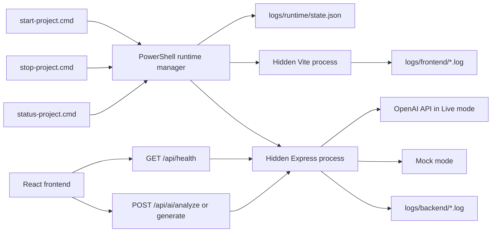

# Company Readiness and Background Runtime Design

Date: 2026-07-31

## Objective

Upgrade AI Whiteboard Assistant from a release-ready student project into a maintainable, supportable, and diagnosable small-company project without changing its product scope or touching the host operating system outside the repository.

The work has three outcomes:

1. Start the frontend and backend in the background from one click, without leaving service terminals open.
2. Make AI Analyze and Generate resilient to backend cold starts and transient network failures while keeping Live AI cost and safety boundaries explicit.
3. Add the operational documentation, validation commands, logs, and quality gates needed for another developer or non-technical operator to use and troubleshoot the project.

## Safety boundary

All implementation and runtime artifacts remain inside `D:\Codex Word\AI-Whiteboard-Assistant`.

The implementation must not:

- install global npm packages;
- modify `PATH`, the registry, PowerShell execution policy, scheduled tasks, or Windows services;
- read or write personal files outside the repository;
- stop a process merely because it uses a known port;
- print or log API keys, environment variables, whiteboard request bodies, or user content;
- create or commit a real `.env` file;
- force-push, overwrite tags, or delete existing project history.

Project-local `node_modules`, `logs`, PID metadata, and build artifacts remain removable by deleting their documented project folders.

## Scope

### Included

- Hidden background startup for the existing frontend and backend.
- One-click start, stop, and status commands.
- Project-local process state and timestamped stdout/stderr logs.
- Duplicate-start prevention and stale-state recovery.
- Safe process ownership checks before stopping.
- AI backend warm-up, bounded retry, timeout, cancellation, and error classification.
- Backend request IDs, privacy-safe access logging, and graceful shutdown.
- Local quality commands and CI alignment.
- A detailed end-user and operator manual.
- Updates to README, architecture, decisions, changelog, todo, and project context.

### Not included

- Authentication, accounts, databases, cloud board persistence, billing, or collaboration.
- Installing PM2 or registering a Windows service.
- Automatic Live AI requests during tests.
- Monitoring SaaS, analytics, or external log storage.
- Large UI redesigns or unrelated whiteboard refactoring.

## Architecture

The existing `project-start.json` remains the source of service commands and readiness URLs. Shared runtime functions live in a project-local PowerShell module or script under `scripts/` so start, stop, and status use identical validation rules.

## Background runtime design

### User entry points

- `start-project.cmd`: validate, start hidden services, wait for readiness, open the browser, and exit.
- `stop-project.cmd`: stop only verified project-owned processes, remove active state, report the result, and exit.
- `status-project.cmd`: report each service as running, ready, stopped, stale, or unhealthy and show current log paths.

The CMD window may remain visible briefly while validation and readiness checks run. It closes automatically after success. It pauses only on an error so the message remains readable.

### State file

The runtime manager writes `logs/runtime/state.json` only after a service process starts. The versioned structure records:

- schema version;
- project root;
- launch timestamp;
- service name;
- process ID;
- process start time in UTC;
- service working directory;
- readiness URL;
- stdout log path;
- stderr log path.

No command-line secrets or environment values are stored.

### Process ownership validation

Before treating a PID as project-owned, start, stop, and status must verify:

1. The recorded project root exactly matches the current repository root.
2. The PID exists.
3. The live process start time matches the recorded start time within a small serialization tolerance.
4. The recorded working directory is inside the repository.
5. The state file uses the supported schema version.

If validation fails, the state is marked stale. The runtime manager does not kill the process. Stale state may be archived or removed only within `logs/runtime` after reporting the condition.

### Starting services

Each service starts with `Start-Process -WindowStyle Hidden`. Standard output and standard error use separate timestamped files because PowerShell cannot redirect both streams to the same path safely.

Startup behavior:

1. Validate configuration and dependencies.
2. Read and validate existing runtime state.
3. If every service is already owned and ready, open the browser without starting duplicates.
4. If dependencies are missing, retain the existing explicit consent prompt before project-local `npm install`.
5. Create log directories inside the project.
6. Start missing services hidden and capture their process metadata.
7. Poll readiness endpoints without the Windows proxy.
8. Open the configured browser URL after all required services are ready.
9. Exit successfully.

If startup fails, stop only services created by that startup attempt, retain their logs, and pause the CMD window with the log paths. Pre-existing verified services remain running.

### Stopping services

Stopping uses the recorded parent PID and process-start timestamp. After ownership validation, the manager stops that process tree so npm wrapper processes do not leave child Node processes behind. It never searches by port and never stops unrecorded processes.

After stopping, it verifies that the process has exited, updates or removes active state, and reports any service that could not be stopped. A failed ownership check results in a warning and no process termination.

### Logs and retention

Logs use timestamped filenames under `logs/backend` and `logs/frontend`. The `logs` directory is ignored by Git except for an optional `.gitkeep` if needed. The manual explains safe deletion: logs may be deleted only when services are stopped, while the directory itself may be recreated automatically.

Automatic deletion is not included in the first implementation. This avoids deleting diagnostic evidence without the user's knowledge.

## AI reliability design

### Client request lifecycle

The frontend AI service gains a single request coordinator used by Analyze and Generate:

1. Resolve and validate the API base URL.
2. Check `GET /api/health` before the first AI request or after the cached readiness result expires.
3. Display a connecting state while a free Render service wakes.
4. Send the validated AI request only after health succeeds.
5. Apply a bounded client timeout.
6. Preserve user input on every failure.
7. Allow one AbortController to cancel warm-up, retry delay, and the final request.

A successful health result is cached briefly in memory. It is not persisted and contains no secret.

### Retry policy

- Mock mode: retry at most once for a network failure or HTTP 502, 503, or 504.
- Live mode: do not automatically retry a model request because a lost response could cause a duplicate paid call.
- HTTP 400, 401, 403, 413, 422: never retry automatically.
- HTTP 429: do not retry automatically; display the server's `Retry-After` guidance.
- Cancellation: never retry.
- Invalid AI response: never retry automatically; retain the manual Retry action.

Retry delay is short and bounded. There is no background loop or continuous polling.

### Timeout policy

Health warm-up and AI requests have separate timeouts. The frontend timeout must be longer than the backend Live AI timeout so backend error responses can arrive normally. Timeout errors are distinct from manual cancellation.

Exact values are configuration constants covered by tests, with conservative defaults suitable for Render Free cold starts and the existing 20-second backend OpenAI timeout.

### User-facing states

The AI panel distinguishes:

- connecting to the backend;
- analyzing or generating;
- retrying once after a temporary failure;
- cancelled;
- rate limited with approximate wait time;
- backend not configured;
- request timed out;
- invalid AI response;
- temporary service failure.

Errors include a safe Request ID when the backend supplied one. The input remains editable, Retry remains explicit, Analyze never changes elements, and Generate continues to require preview and Apply.

## Backend diagnostics and lifecycle

### Request IDs

Middleware accepts a syntactically safe incoming request ID or creates a new UUID. The ID is returned in an `X-Request-Id` header and included in structured error responses as an optional field.

### Privacy-safe access logs

For API requests, the backend logs one compact record containing:

- timestamp;
- request ID;
- method;
- route path;
- status code;
- duration;
- AI mode where relevant.

It does not log query contents, request bodies, element data, whiteboard text, headers, cookies, environment variables, provider responses, tokens, or API keys.

Local logs flow through the launcher's redirected stdout/stderr files. Render continues to collect stdout/stderr normally.

### Health and shutdown

`GET /api/health` remains public and secret-free. It may add process uptime and a version identifier but must not expose environment values or provider diagnostics.

The backend entry point handles `SIGINT` and `SIGTERM`, stops accepting new connections, allows a short bounded shutdown window, and exits. Tests cover the app behavior; process-signal handling is kept small and deterministic.

## Engineering quality

### Runtime and package metadata

- Declare the supported Node.js major version consistently in frontend, backend, CI, and documentation.
- Add backend linting with a project-local development dependency only if the existing tool can be reused without introducing a second lint stack.
- Add `check` scripts that compose existing lint, test, typecheck, and build commands.
- Keep all dependencies inside the relevant project directory.

Any new third-party dependency requires a documented purpose, npm source, and risk review before installation. Prefer platform APIs and existing packages.

### One-click verification

Add a project-local verification entry point that runs configuration validation and the existing frontend/backend checks. It must not install dependencies without consent and must not access Live AI.

### CI

GitHub Actions remains the authoritative remote quality gate. The implementation aligns local check commands with CI and preserves the existing Playwright Mock-mode environment. No paid API key is required in CI.

## Documentation deliverables

### Detailed user manual

Create `docs/USER_MANUAL.md` and link it prominently from README. It must contain explicit, numbered instructions for:

- project location and prerequisites;
- checking Node.js and npm;
- first launch and dependency consent;
- normal one-click startup;
- what the brief CMD window means;
- confirming frontend and backend readiness;
- opening the browser manually;
- checking status;
- stopping services safely;
- behavior when closing the browser or shutting down Windows;
- duplicate startup behavior;
- locating and reading stdout/stderr logs;
- safe log cleanup;
- Mock Analyze and Generate usage;
- Live mode configuration using `.env.example` without exposing a real key;
- AI cold start, timeout, rate limit, network, configuration, and invalid-response errors;
- occupied ports and stale state;
- missing dependencies;
- local quality checks and E2E tests;
- Git safety checks;
- updating dependencies deliberately;
- removing runtime files and completely stopping the local project;
- a symptom-to-action troubleshooting table.

Commands use Windows PowerShell syntax and absolute examples matching the repository, while clearly marking values users must replace.

### Project documentation

Update:

- `README.md` with quick start, quick stop, status, and manual links;
- `PROJECT_CONTEXT.md` with runtime and reliability architecture;
- `docs/architecture.md` with process and AI request flows;
- `docs/decisions.md` with the background runtime and bounded retry decisions;
- `docs/changelog.md` and `docs/todo.md` with completed work and remaining limitations;
- `SECURITY.md` with responsible reporting and secret-handling guidance.

## Testing strategy

### Launcher tests

- Configuration-only validation.
- First start creates project-local state and log files.
- Services become ready and the launcher exits.
- No visible service terminal remains.
- Duplicate start does not create duplicate service processes.
- Status reports healthy services and log locations.
- Stop releases frontend and backend readiness endpoints.
- Stop does not terminate a mismatched or stale PID.
- Failed startup cleans up only processes created by that attempt.
- Paths containing spaces remain supported.

Launcher acceptance must count relevant project-owned process IDs before and after the test and clean up only the processes it created.

### Frontend tests

- Health warm-up success and failure.
- Mock transient failure retries once.
- Live request is not automatically retried.
- 429 displays retry guidance and does not retry.
- Timeout is distinct from cancellation.
- Abort cancels warm-up, retry delay, and request.
- Request ID appears only as diagnostic text.
- Existing Analyze, Generate, preview, Apply, and batch history tests remain green.

### Backend tests

- Request ID generation, propagation, and safe validation.
- Privacy-safe access log fields.
- Error responses include the request ID without internal details.
- Health remains secret-free.
- Graceful shutdown helper behavior where practical.
- Existing schema, rate-limit, CORS, Mock, Live-runner, and security tests remain green.

### Full acceptance

- Frontend lint, unit tests, and production build.
- Backend lint, tests, typecheck, and build.
- Playwright E2E.
- Background start/status/stop acceptance on Windows.
- `git diff --check`.
- Secret and tracked-artifact scan.
- No real Live AI request.

Playwright trace inspection is used only if E2E fails.

## Implementation stages

1. Add shared runtime state, hidden start, status, stop, logs, and launcher tests.
2. Add frontend AI health, timeout, retry, error classification, and tests.
3. Add backend request IDs, safe logging, graceful shutdown, and tests.
4. Add project checks, security documentation, detailed user manual, and architecture updates.
5. Run the complete local and online Mock acceptance, inspect Git safety, then prepare a normal non-force commit and push only if explicitly requested.

Each stage must pass its relevant tests before the next stage begins. Existing whiteboard behavior is not refactored as part of this work.

## Acceptance criteria

- A user can double-click start, close the brief launcher window, and continue using the running app.
- A user can check status and stop the project without opening or identifying terminal windows.
- Stopping never targets an unverified process.
- Logs and runtime state stay inside the repository and are excluded from Git.
- AI cold starts and transient Mock failures recover once or produce a precise actionable error.
- Live mode never performs an automatic paid retry.
- Request IDs connect frontend errors to privacy-safe backend logs.
- The detailed manual explains start, stop, status, logs, AI usage, and recovery without assuming developer knowledge.
- All existing functionality, security boundaries, local tests, E2E tests, and builds continue to pass.
